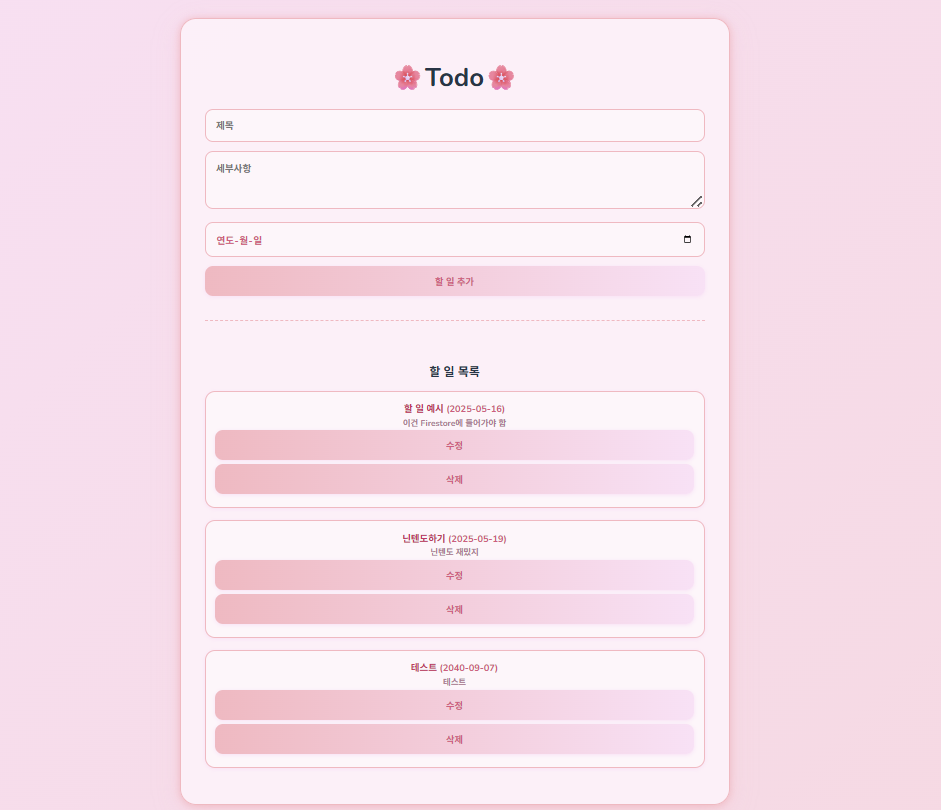
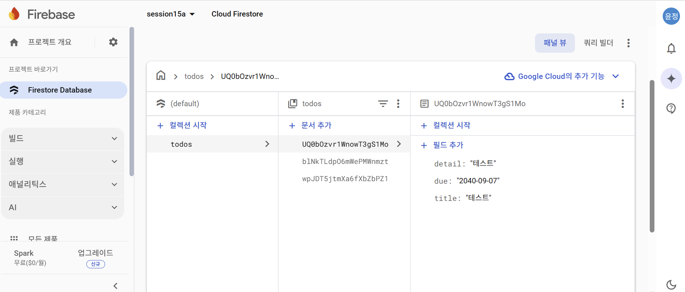

# Firebase Todo App

간단한 Firebase 기반 Todo 웹입니다.  
할 일을 추가, 수정, 삭제할 수 있으며 모든 데이터는 Firestore에 저장됩니다.
핑크톤의 닌텐도를 디자인 모티프로 삼았습니다.

---

## 🔧 사용 기술

- **React (Vite)**
- **Firebase Firestore**
- HTML / CSS

---

## 📌 구현 기능

| 기능 | 설명 |
|------|------|
| ✅ 할 일 추가 (Create) | 사용자 입력을 Firestore에 저장 |
| ✅ 할 일 목록 보기 (Read) | 저장된 데이터 목록을 실시간으로 렌더링 |
| ✅ 할 일 수정 (Update) | 기존 데이터를 편집 후 업데이트 가능 |
| ✅ 할 일 삭제 (Delete) | Firestore 문서를 실제로 삭제 (Hard Delete) |

---

## 📷 화면 캡처

### ✅ 앱 화면
> 사용자가 할 일을 입력하고 목록을 확인하는 UI



---

### ✅ Firestore DB 화면
> `todos` 컬렉션 내 문서가 Firestore에 저장된 모습



---

## 🚀 실행 방법

1. 프로젝트 클론
```bash
git clone https://github.com/yourname/todo-firebase-app.git
cd todo-firebase-app
